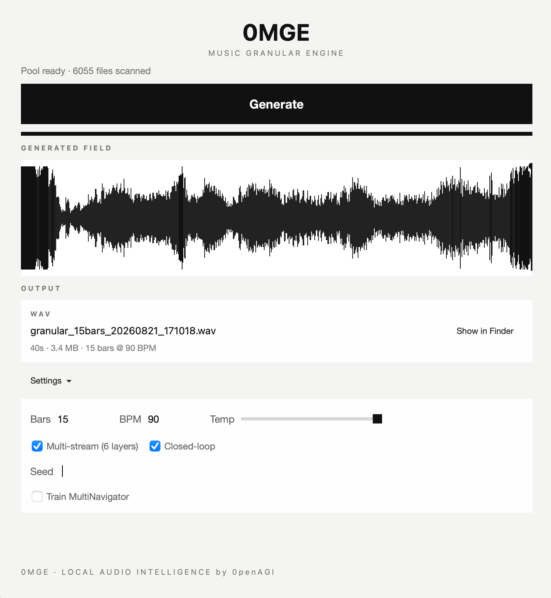
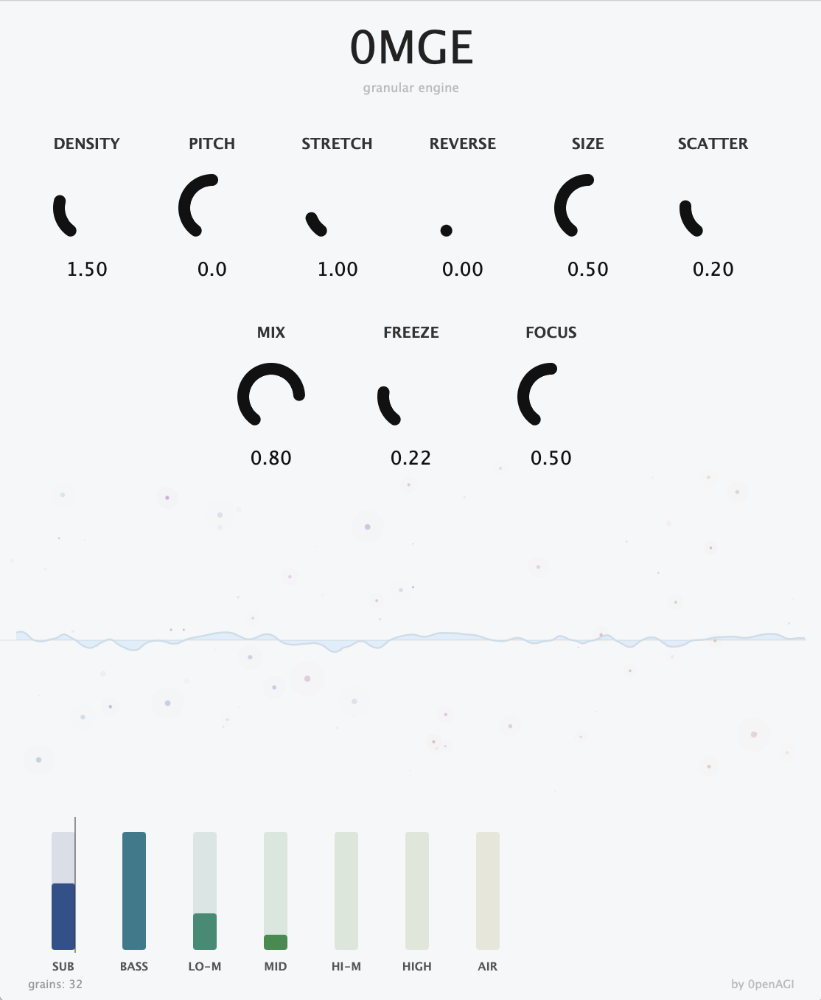

# 0MGE — Neural Granular Engine

> **AI music generation from YOUR music.** No cloud. No API. No subscription. Runs entirely on your machine.

[](LICENSE)
[](https://python.org)
[](https://pytorch.org)
[]()
[](https://huggingface.co/0penAGI/0MGE)
[](https://0penagi.github.io/0MGE/)

A neural network that learns from YOUR music and generates new sound. Launch the app, point it at your music folder — it scans, trains, and generates. All locally.

**[Listen to demo](https://0penagi.github.io/0MGE/)** · **[Download models](https://huggingface.co/0penAGI/0MGE)** · **[VST Plugin](#vst3au-plugin)**

---

## What is 0MGE?

0MGE is a **neural granular engine** — it scans your music library, extracts millions of micro-grains (tiny audio fragments), trains a neural navigator on them, and generates entirely new drone landscapes and textures.

**Your music IS the instrument.** Different library = different output. That's the point.

It's NOT text-to-music. It doesn't generate beats or songs. It learns the sonic DNA of your library and reassembles it into something new.

---

## Quick Start

### Option 1: Desktop App (Recommended)

```bash
git clone https://github.com/0penAGI/0MGE.git && cd 0MGE
./bootstrap.sh    # macOS / Linux
# or: setup.bat   # Windows
```

Opens the desktop app. Select your music folder, hit Generate. That's it.

### Option 2: CLI

```bash
pip install numpy torch librosa scikit-learn soundfile
python3 granular_field.py --bars 60 --multi-stream
```

### Option 3: Pre-trained Demo

```bash
# Download from HuggingFace and generate with pre-trained model
python3 granular_field.py \
  --pool granular_pool_v2_int16.npz \
  --model granular_multi_v1.pt \
  --bars 60 --multi-stream
```

---

## How It Works

```
your music → scan → extract grains → cluster → train navigator → generate new sound
```

1. **Scan** — finds all audio (MP3, FLAC, WAV, OGG, AAC)
2. **Extract** — cuts every track into micro-grains (55ms–3s), 22 spectral features per grain
3. **Cluster** — groups grains into 1024 clusters
4. **Train** — MultiNavigator Transformer learns to walk the grain field (6 parallel streams)
5. **Generate** — assembles new stereo WAV from your grains

Different music → different grain pool → different navigator → different output. Every library sounds unique.

---

## Components

### Desktop App



PySide6 (Qt) desktop interface. The main way to use 0MGE.

- Auto-detects Music/Downloads/Ableton/external drives
- Extracts micro-grains from every track
- Builds grain pool locally (~64MB lite cache)
- Trains MultiNavigator on your grains
- Generates stereo WAV with built-in player
- Settings persist between sessions

### VST3/AU Plugin



**Completely separate from the neural engine.** A real-time granular processor built with JUCE 8.0.6. No AI — pure DSP.

Takes incoming audio from your DAW and chops it into grains in real time. Each grain is a tiny snapshot of the input signal, played back with its own pitch, position, direction, and spatial placement.

**9 knobs:** Density, Pitch, Stretch, Reverse, Size, Scatter, Mix, Freeze, Focus

**Freeze reverb:** LP filter + 12% L/R crossfeed in feedback path. Creates evolving drones from any input.

**32 voices**, COLA Hanning envelope (click-free), circular buffer (10s at 48kHz).

```bash
cd vst && mkdir build && cd build
cmake -G Xcode .. && cmake --build . --config Release
```

### Neural Engine

```bash
# From your music (app does this automatically)
python3 granular_field.py --bars 60 --multi-stream

# With pre-trained demo model
python3 granular_field.py --pool granular_pool_v2_int16.npz --model granular_multi_v1.pt --bars 60 --multi-stream
```

### Genome Scanner

Beat-aware audio collage generator. Cuts tracks into beat-aligned fragments, tempo-normalizes, pitch-matches, arranges into new tracks.

---

## Architecture

**MultiNavigator** — Transformer (4 attention heads, 3 layers, 192 hidden). 6 independent stream heads pick grains from the pool.

| Stream | Frequency | Role |
|--------|-----------|------|
| sub | 20–120 Hz | Deep bass |
| drums | 120–500 Hz | Percussion |
| harmonic | 500–2000 Hz | Tonal harmonics |
| texture | 2–4 kHz | Presence |
| noise | 4–8 kHz | Detail |
| air | 8–11 kHz | Upper spectrum |

### Grain Pool

Three-tier hierarchy (STFT, n_fft=1024, hop=256):

| Level | Duration | Count |
|-------|----------|-------|
| Micro (μ) | ~55ms | 425K |
| Meso (σ) | ~300ms | 118K |
| Macro (Ω) | ~3s | 23K |
| **Total** | — | **566K** |

### Quantization

INT8 navigator only (grain pool stays INT16):

| Metric | FP32 | INT8 | Delta |
|--------|------|------|-------|
| Critic score | 0.292 | 0.285 | 0.008 |
| File size | 5.3 MB | 1.4 MB | 3.9× |

---

## Downloads

### VST3 / AU Plugin Installer

| Platform | File | Install |
|----------|------|---------|
| macOS | [0MGE-1.0.0-macOS.pkg](release/macos/0MGE-1.0.0-macOS.pkg) (8.6 MB) | Double-click → admin password → done |
| Windows | `0MGE_setup.exe` | Coming soon (GitHub Actions builds it) |

### Manual Install (no installer needed)

Download, unzip, copy to your DAW's plugin folder:

| What | Download | Unzip & copy to |
|------|----------|-----------------|
| **VST3** (macOS) | [0MGE-vst3-macOS.zip](0MGE-vst3-macOS.zip) (1.4 MB) | `~/Library/Audio/Plug-Ins/VST3/` |
| **AU** (macOS, Logic only) | [0MGE-au-macOS.zip](0MGE-au-macOS.zip) (1.3 MB) | `~/Library/Audio/Plug-Ins/Components/` |
| **Standalone App** (macOS) | [0MGE-app-macOS.zip](0MGE-app-macOS.zip) (1.6 MB) | Drag `0MGE.app` to `/Applications/` |

```bash
# After unzipping:
cp -R 0MGE.vst3 ~/Library/Audio/Plug-Ins/VST3/
cp -R 0MGE.component ~/Library/Audio/Plug-Ins/Components/
cp -R 0MGE.app /Applications/
```

Restart your DAW after copying. Uninstall: delete the files above.

### Pre-trained Models ([HuggingFace](https://huggingface.co/0penAGI/0MGE))

| File | Size | Description |
|------|------|-------------|
| `granular_multi_v1.pt` | 5.3 MB | 6-stream navigator |
| `granular_multi_v1_int8.npz` | 1.4 MB | Navigator INT8 quantized |
| `granular_pool_v2_int16.npz` | 4.9 GB | Full grain pool (566K grains) |
| `granular_pool_lite.npz` | 64 MB | Lite pool (features only) |

### Demo Audio

| Sample | Duration | Description |
|--------|----------|-------------|
| [Landscape #1](samples/drone-01.mp3) | 16s | INT8 quantized |
| [Landscape #2](samples/drone-02.mp3) | 32s | 6-stream generation |
| [Full Pool Demo](samples/drone-03.mp3) | 60s | 566K grains |
| [Quantized vs Original](samples/drone-04-int8.mp3) | 16s | INT8 vs FP32 comparison |

---

## Links

- **[Demo](https://0penagi.github.io/0MGE/)** — listen to generated audio
- **[HuggingFace](https://huggingface.co/0penAGI/0MGE)** — download models and pool
- **[Issues](https://github.com/0penAGI/0MGE/issues)** — report bugs, request features

---

## Related Projects

- [Magenta](https://magenta.tensorflow.org/) — Google's music generation research
- [Meta's AudioCraft](https://github.com/facebookresearch/audiocraft) — audio generation with transformers
- [DDSP](https://github.com/magenta/ddsp) — differentiable digital signal processing
- [JUCE](https://juce.com/) — audio application framework (used for VST plugin)

---

## Citation

```bibtex
@software{0mge2026,
  title={0MGE: Neural Granular Engine},
  author={0penAGI},
  year={2026},
  url={https://github.com/0penAGI/0MGE}
}
```

## License

MIT

---

**by [0penAGI](https://github.com/0penAGI)** · Neural engine trained on music by **Slut Online** with permission.
